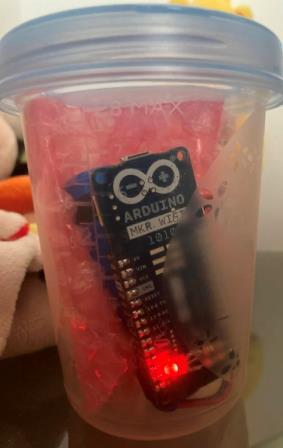

## Night Clock

### Hardware
Controller: ATSAMD21 (ARM Cortex M0) on an [Arduino MKR WiFi 1010](https://store.arduino.cc/en-at/collections/iot-cloud-compatible/products/arduino-mkr-wifi-1010)

### Short description

The intention was to have a very simple night clock which is understandable for a toddler. So, the basic idea is to have a red light when it's bed-time and a green light when it's okay to get up - as easy as that 😉

The very first concept approach was to use an ESP8266 and to periodically get the time from the network (NTP), but this requires to always have a WiFi connection and to periodically request time, which was quite power consuming. 
Next step was to switch to a board with an onboard RTC. However, as it turned out, the Arduino Nano 33 IoT does not have a crystal and the onboard oscillator is too inaccurate and makes the RTC to trift too much.

After finally switching to the Arduino MKR WiFi 1010 board, the RTC runs very stable. It also comes with an RGB LED, however, due to whatever reason, it is controlled through the GPIOs of the NINA module, which requries it to be powered on constantly and results in high power consumption. So, back to the basics and use a simple two-color LED which does the job nicely.

### Configuration

You need to rename & complete `credentials.h` with your WiFi connection details.